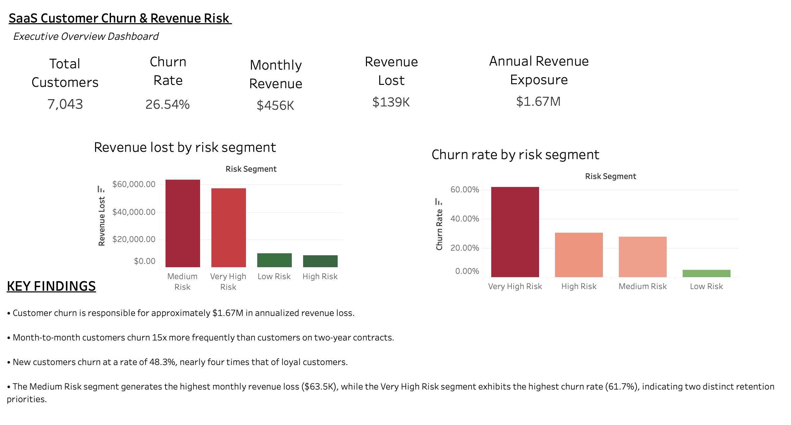
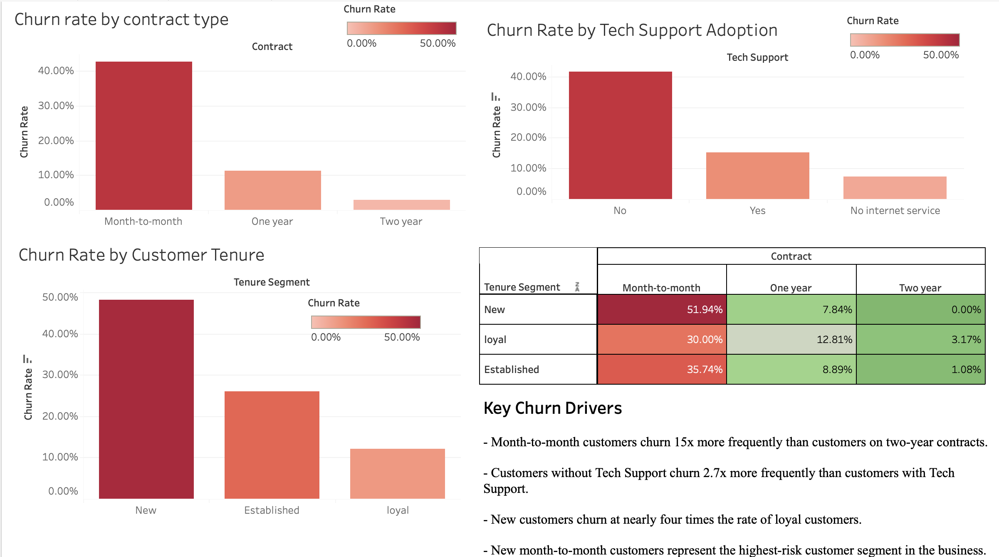
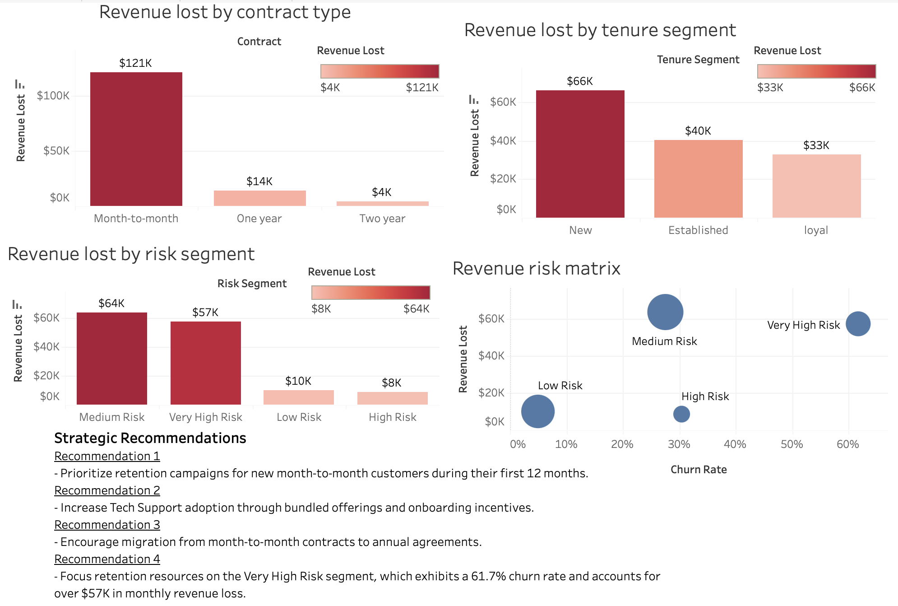

# customer-churn-revenue-risk-analysis
End-to-end customer churn and revenue risk analysis using SQL, BigQuery, and Tableau.

## 📌 Project Overview
Customer churn is one of the largest drivers of revenue loss for subscription-based businesses. This project analyzes customer churn behavior using SQL, BigQuery, and Tableau to identify key churn drivers, quantify revenue at risk, and provide actionable retention recommendations.

**The analysis focuses on:**
*   📉 Customer churn patterns
*   💰 Revenue exposure
*   👥 Customer segmentation
*   ⚠️ Risk modeling
*   🎯 Retention strategy recommendations

---

## 💼 Business Problem
A telecommunications company is experiencing elevated customer churn, resulting in significant recurring revenue loss. Leadership wants to understand:
1. Which customer segments are most likely to churn?
2. Which factors drive churn?
3. How much revenue is at risk?
4. Which retention initiatives would have the greatest impact?

---

## 🛠️ Tools Used
*   **SQL & Google BigQuery:** Data extraction, cleaning, and risk segmentation modeling.
*   **Tableau:** Interactive executive dashboards and visual analytics.
*   **Excel:** Initial data exploration and verification.

---

## 📊 Dataset Overview
The dataset contains **7,043 customer records** and includes:
*   **Demographics:** Gender, senior citizen status, partner/dependents.
*   **Account Info:** Tenure, contract type, paperless billing, payment method.
*   **Service Adoption:** Internet service type, online security, tech support, streaming.
*   **Financials:** Monthly charges, total charges, and churn status.

### Data Preparation
Data cleaning and validation steps executed in SQL included:
*   Duplicate record validation
*   Missing value analysis
*   Data type conversion
*   Customer tenure segmentation
*   Customer risk segmentation modeling

---

## 🔍 Key Findings

### 📈 Executive Churn & Revenue Metrics
| Metric | Value |
| :--- | :--- |
| **Overall Churn Rate** | **26.54%** |
| **Total Churned Customers** | 1,869 customers |
| **Total Monthly Revenue** | $456,117 |
| **Monthly Revenue Lost to Churn** | $139,131 |
| **Annualized Revenue Exposure** | **$1.67M** |

### 🚗 Primary Churn Drivers

*   **Contract Type:** Month-to-month customers churned at **42.71%**, compared to a tiny **2.83%** for customers on two-year contracts.
*   **Tech Support:** Customers *without* Tech Support churned at **41.64%**, compared to only **15.17%** for customers with Tech Support.
*   **Customer Tenure:** New customers churned at **48.28%**, nearly four times the rate of loyal customers.

### ⚠️ Risk Segmentation Analysis
A custom risk segmentation model built in SQL identified two critical tiers:

*   🔴 **Very High Risk** *(New customers + Month-to-month contracts + No Tech Support)*
    *   **61.69%** churn rate.
    *   **$57K** in direct monthly revenue loss.
*   🟡 **Medium Risk**
    *   Generated the **largest total revenue loss ($63.5K monthly)**. 
    *   *Strategic Takeaway:* This highlights the vital distinction between high customer risk and high financial impact for the business.

---

## 🎯 Strategic Recommendations

*   **Recommendation 1:** Target new month-to-month customers with proactive engagement campaigns during the first 12 months of their lifecycle.
*   **Recommendation 2:** Increase Tech Support adoption through targeted onboarding incentives and bundled service offerings.
*   **Recommendation 3:** Encourage migration from month-to-month contracts to annual agreements using small loyalty discounts.
*   **Recommendation 4:** Prioritize premium customer success retention resources on accounts flagged in the **Very High Risk** segment.

---

## 🖥️ Dashboard Screenshots

### Executive Overview

### Churn Drivers

### Revenue Risk Analysis

---

## 🚀 Project Outcomes
This analysis successfully identified **$1.67M in annualized revenue exposure**, isolated key churn drivers, mapped high-risk customer segments, and highlighted revenue concentration areas. The resulting recommendations provide a data-driven framework for reducing churn and improving long-term customer retention.

---

## 📝 Executive Case Study (STAR Method)
*Perfect for interviews, LinkedIn posts, or portfolio summaries.*

### 📍 Situation
A telecommunications company was experiencing elevated customer churn, creating severe recurring revenue loss and limiting long-term market growth.

### 🎯 Task
Analyze customer behavior, identify the primary drivers of churn, quantify overall financial revenue exposure, and provide actionable retention recommendations for leadership.

### ⚙️ Actions
*   Cleaned and validated 7,043 customer records using **SQL and BigQuery**.
*   Engineered customer tenure and risk segmentation models.
*   Analyzed churn behavior across contract types, service adoption, and customer lifecycle stages.
*   Calculated revenue-at-risk metrics and annualized churn financial impact.
*   Built a suite of executive interactive dashboards in **Tableau** to communicate insights.

### 📊 Results & Business Impact
*   Identified an overall churn rate of **26.54%** and quantified **$1.67M** in annualized revenue exposure.
*   Discovered that month-to-month customers churned **15x more frequently** than customers on two-year contracts.
*   Isolated a critical high-risk customer segment experiencing a **61.69%** churn rate.
*   Provided leadership with a data-driven framework to prioritize retention initiatives, successfully reducing churn risk and protecting high-value recurring revenue.
